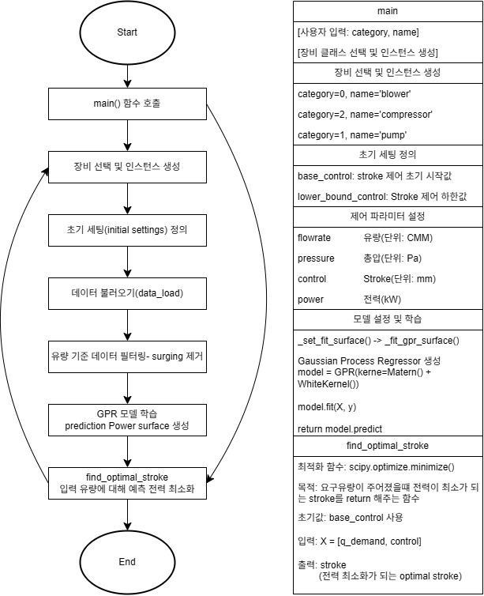
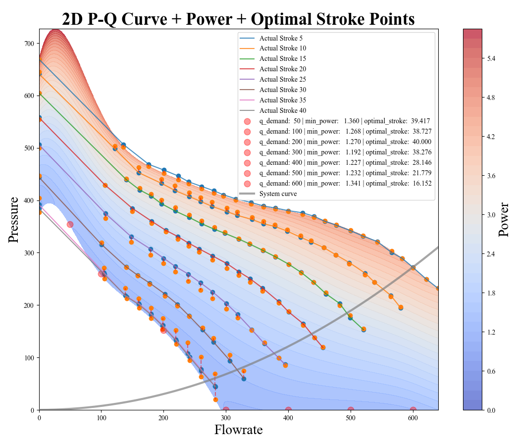
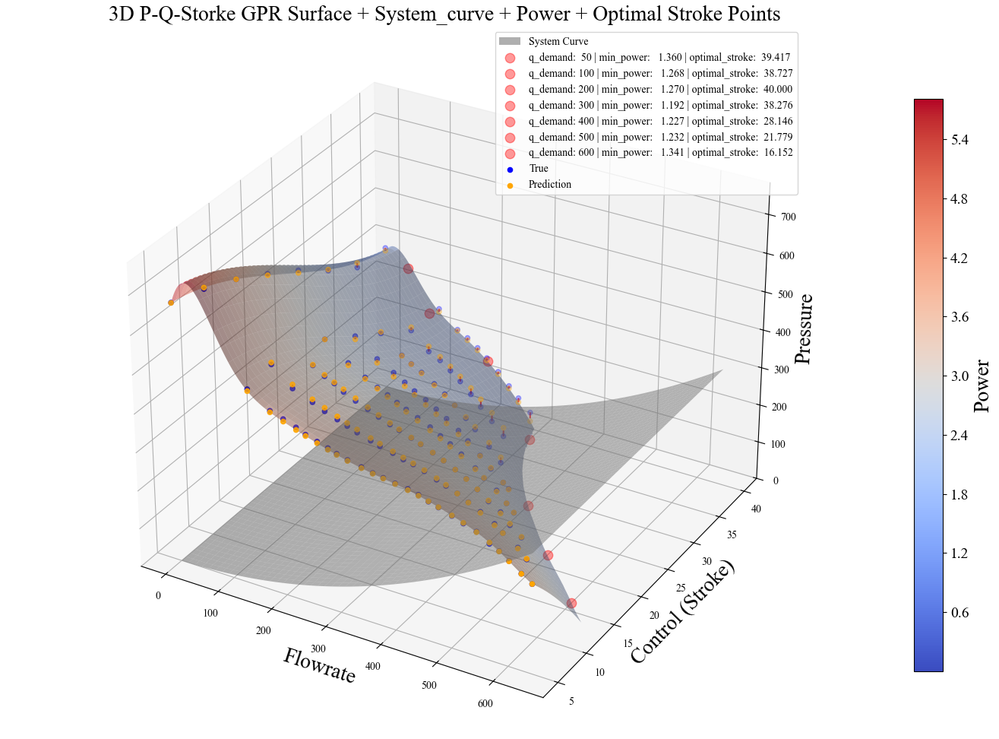
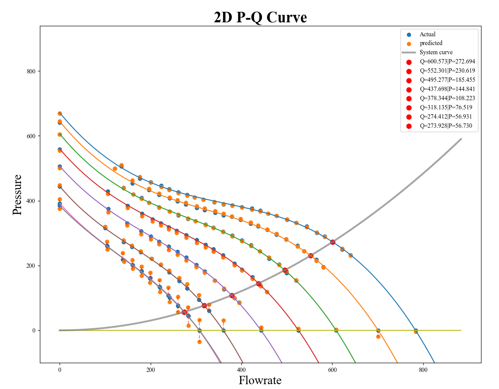
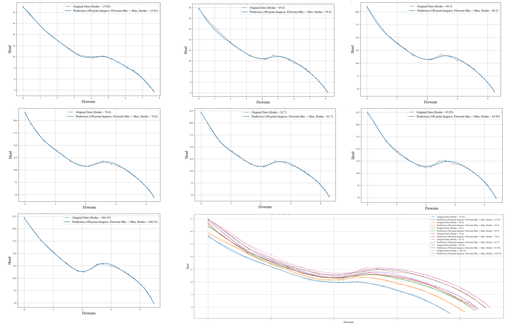
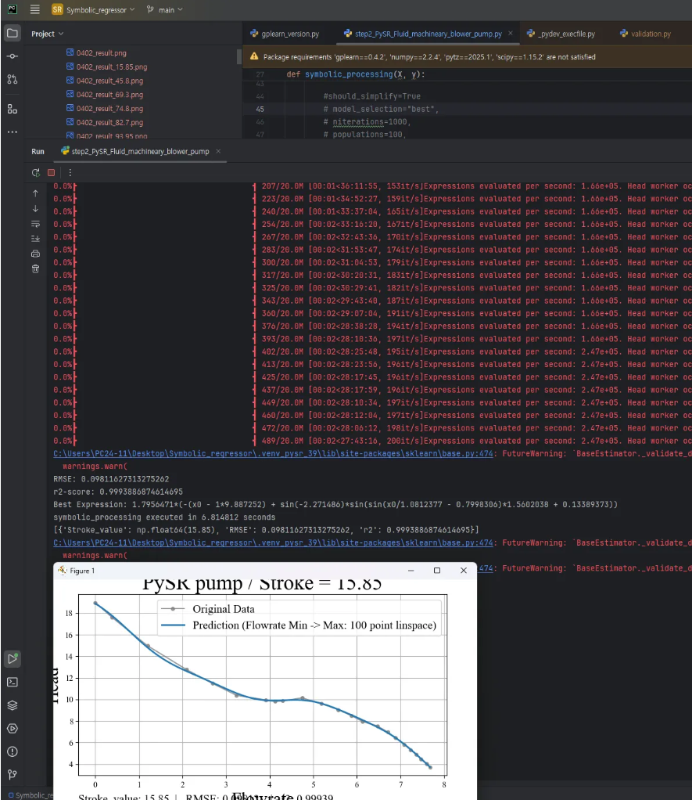

## Fluid Machinery — P-Q Curve Symbolic Regression & Optimal Stroke


---

## 유체 기계 개요

| 장비 | 압력비 | 유체 | 설명 |
|------|--------|------|------|
| Compressor | > 1.1 | 기체 | 체적 감소로 가스 압력 증가 |
| Blower | 1.01 ~ 1.1 | 기체 | 고유량 중간 압력 |
| Pump | — | 액체 | 기계 에너지 전달로 액체 이송 |

---

## 시스템 구조

요구 유량(q_demand)이 주어졌을 때, 전력이 최소화되는 **최적 stroke**를 탐색하는 파이프라인.



| 단계 | 내용 |
|------|------|
| 장비 선택 | category(0=blower, 1=pump, 2=compressor), name 지정 |
| 초기 설정 | `base_control`: 제어 초기값, `lower_bound_control`: Stroke 하한값 |
| 주요 파라미터 | flowrate(CMM), pressure(Pa), control=Stroke(mm), power(kW) |
| GPR 학습 | `GPR(kernel=Matern() + WhiteKernel())` 로 power surface 생성 |
| 최적화 | `scipy.optimize.minimize()` 로 전력 최소화 stroke 탐색 |

---

## P-Q 커브 시각화

### 2D P-Q Curve + Power + Optimal Stroke Points



> stroke 5~40 범위에서 각 요구 유량(q_demand: 50~600)별 최소 전력 지점과 optimal stroke를 표시

### 3D P-Q Curve + Power + Optimal Stroke



### P-Q 교차점 탐색



---

## P-Q 커브 수식화 (Symbolic Regression with PySR)

각 stroke 조건에서 **Flowrate → Head** 관계를 닫힌 수식(closed-form)으로 근사하기 위해 PySR을 사용.

### 실험 1 — 순수 다항식 근사 (0409)

`이정환_PySR_0409_실험_결과.pdf`

**목표**: x, x², x³, ... 순수 다항식만으로 P-Q 곡선 근사 시도

```
사용 함수: pow2(x)=x^2, pow3(x)=x^3, pow4(x)=x^4
```

**결과**: 전체 흐름은 근사 가능하지만 **중간의 비선형 곡률 표현 실패**

- 가중치 기반 손실 함수 적용 (`sample_weight[mid_range] = 8.0`) 시도
- 최종 도출 수식: `f(x) = 0.00808x⁵ − 0.18902x⁴ + 1.46868x³ − 4.00379x² + 21.56254`
- 그러나 RMSE: 0.45682, R²: 0.98685 — 곡률 한계 여전

**결론**: 순수 다항식만으로는 비선형 부분 표현 불가 → **sin/cos/tanh 오퍼레이터 추가 필요**

---

### 실험 2 — Polynomial + cos (0410)

`0410 실험 계획 및 결과.pdf`

**목표 수식 구조**:

```
f(x) = a·x + b·cos(c + d·x) + e
```

| 기호 | 의미 |
|------|------|
| a | x의 선형 계수 |
| b | cos 앞의 계수 |
| c | cos 안의 상수항 |
| d | cos 안의 x 계수 |
| e | 상수항 (bias term) |

#### PySR 설정 (최종)

```python
niterations = 1000
populations = 50
population_size = 300
binary_operators = ["+", "-", "*", "^"]
unary_operators = ["cos"]
constraints = {"^": (-1, 0), "cos": (-1, 2)}
nested_constraints = {"cos": {"cos": 0}, "^": {"^": 0}}
maxsize = 15
parsimony = 0
random_state = 42
```

> sin vs cos 비교 실험 결과: 두 함수 간 유의미한 차이 없음 → **cos만으로 충분**

#### sin vs cos 실험 비교

| 실험 | unary_operator | maxsize | RMSE | R² |
|------|---------------|---------|------|----|
| Polynomial + sin | sin | 20 | 0.16228 | 0.99834 |
| Polynomial + cos | cos | 20 | 0.15927 | 0.99840 |

---

### 7개 Stroke 데이터 실험 결과



| Stroke | a | b | c | d | e | RMSE | R² |
|--------|---|---|---|---|---|------|----|
| 15.85 | -1.7189162 | 1.450246 | 0.3792143 | 1 | 17.361654 | 0.16761 | 0.99822 |
| 45.8 | -1.684188 | 1.879294 | 0.66195387 | 0.8985187 | 18.144154 | 0.18892 | 0.99761 |
| 69.3 | -1.875963 | 2.581567 | 1.1242205 | 0.7695822 | 19.765572 | 0.22449 | 0.99621 |
| 74.8 | -2.046656 | 3.055841 | 1.380706 | 0.7094332 | 20.735489 | 0.25090 | 0.99620 |
| 82.7 | -2.1507673 | 3.397003 | -1.4442109 | -0.68809354 | 21.526495 | 0.24653 | 0.99625 |
| 93.95 | -2.0008087 | 3.4007766 | 1.316023 | 0.70412683 | 21.505032 | 0.26476 | 0.99558 |
| 104.35 | -1.6076496 | 2.6261282 | -0.81846154 | -0.6879015 | 20.074152 | 0.29490 | 0.99388 |

> 모든 stroke에서 **R² > 0.993** 달성

---

## 계수 예측 모델 (Stroke → a, b, c, d, e)

stroke 값을 입력으로 받아 수식의 각 계수(a~e)를 예측하는 모델 구축 시도.

```
X_train → Stroke,  y_train → a (또는 b, c, d, e)
```



### 실험 (1) — LinearRegression

| Parameter | RMSE | MAE | R² |
|-----------|------|-----|----|
| a | 0.1814 | 0.1456 | 0.0909 |
| b | 0.3806 | 0.3116 | 0.6947 |
| c | 0.9937 | 0.8697 | 0.0498 |
| d | 0.5214 | 0.4648 | 0.4232 |
| e | 0.7671 | 0.6261 | 0.7341 |

### 실험 (2) — LinearRegression + PolynomialFeatures(degree=2)

| Parameter | RMSE | MAE | R² |
|-----------|------|-----|----|
| a | 0.1554 | 0.1442 | 0.3332 |
| b | 0.3344 | 0.3144 | 0.7644 |
| c | 0.9299 | 0.7067 | 0.1680 |
| d | 0.4881 | 0.3504 | 0.4945 |
| e | 0.6964 | 0.6506 | 0.7808 |

> (1), (2) 간 유의미한 성능 차이 없음

### 향후 계획

- `Polynomial + SVR` 조합 시도 (데이터가 작아 polynomial로 feature 확장 후 SVR 적용)
- `maxsize` 를 20~25로 늘려 수식 복잡도 향상 후 재실험
