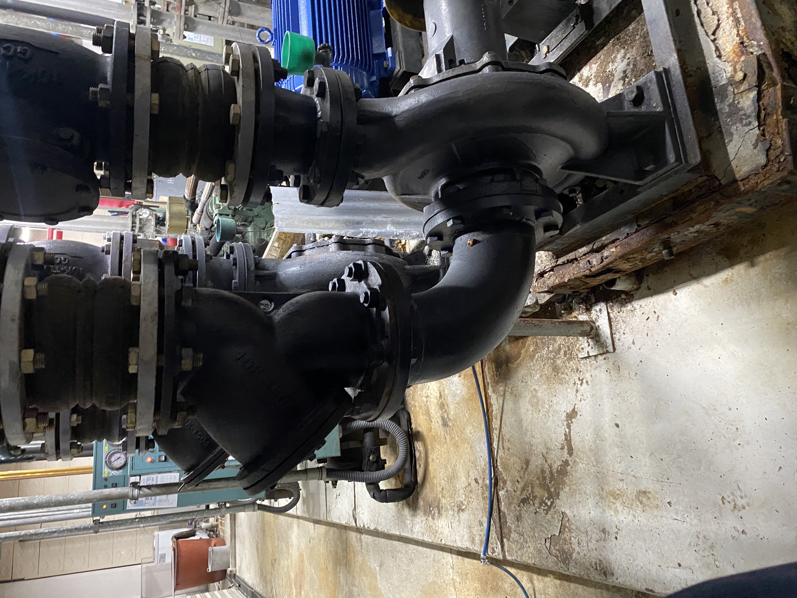
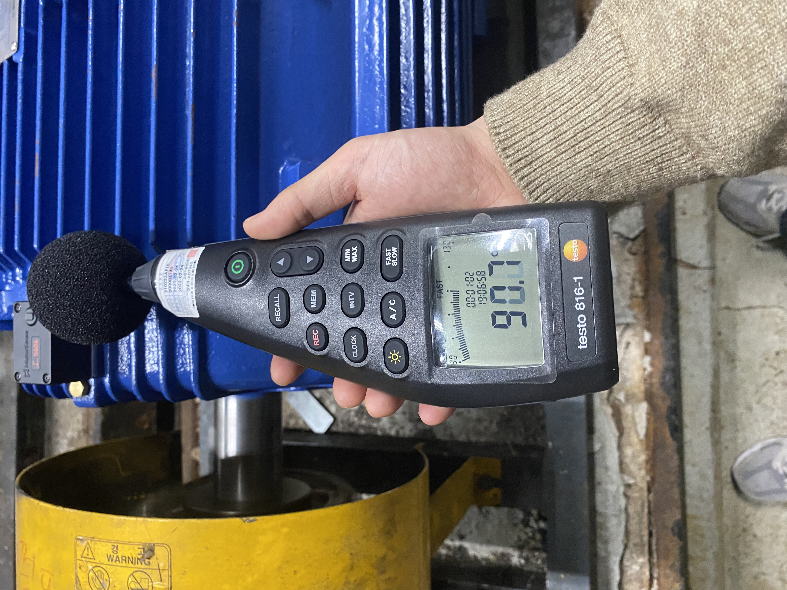
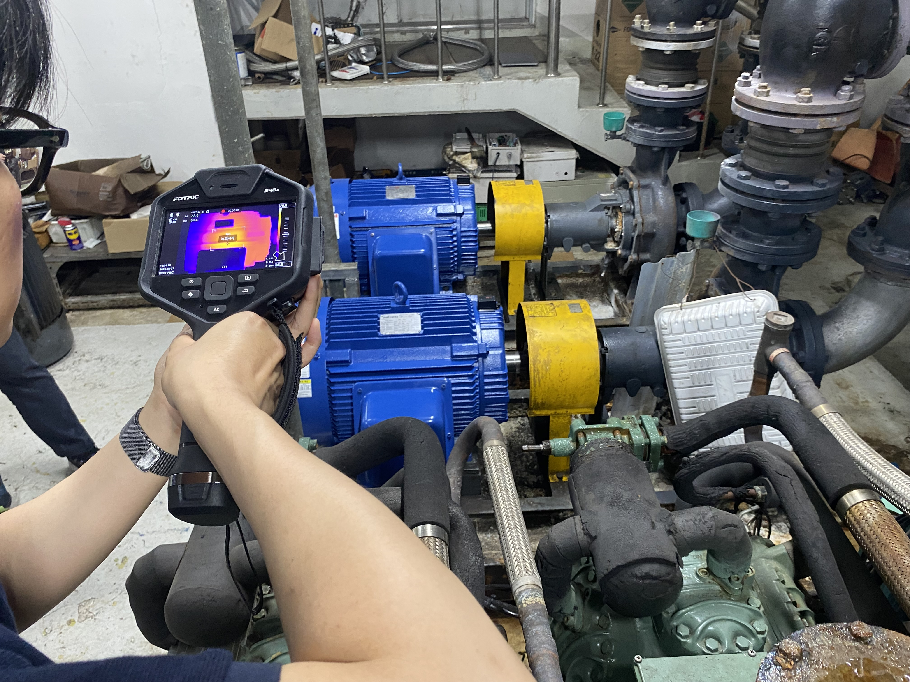
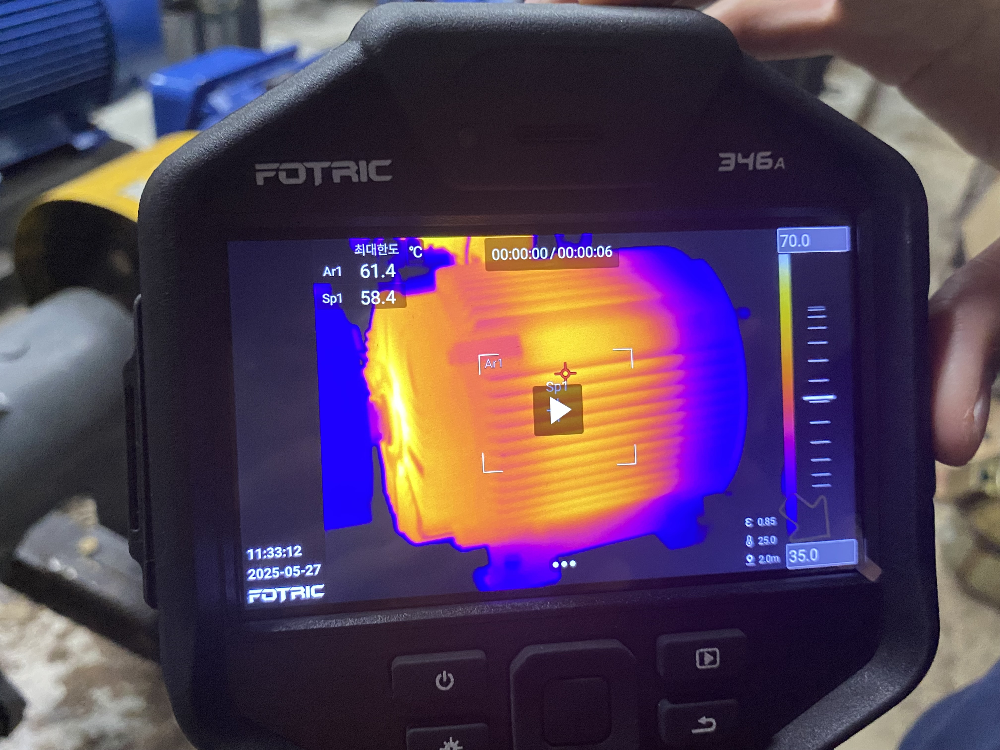
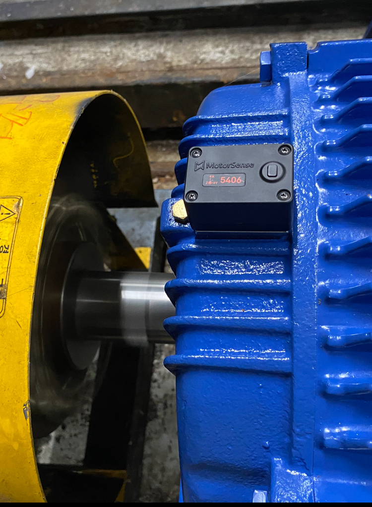

## ⚡ IE4 Super Premium Efficiency Induction Motor

IE4 고효율 인덕션 모터에 대한 현장 실험 기록입니다.
열화상 카메라(온도 측정), 소음계(소음 측정), MotorSense 센서(진동·상태 측정) 데이터를 API를 통해 수집하였습니다.

---

## 실험 설비 전경

> 파란색 IE4 인덕션 모터 + 검은색 배관 및 밸브로 구성된 펌프 설비

---

## 측정 항목

### 1. 소음 측정 — testo 816-1

| 항목 | 값 |
|------|-----|
| 측정 장비 | testo 816-1 |
| 측정값 | **90 dB** |
| 측정 위치 | 모터 근접부 |

---

### 2. 온도 측정 — 열화상 카메라 (FOTRIC 346A)

| 항목 | 값 |
|------|-----|
| 측정 장비 | FOTRIC 346A |
| 최대 온도 (Ar1) | **61.4 °C** |
| 측정 포인트 (Sp1) | **58.4 °C** |
| 측정 일시 | 2025-05-27 11:33:12 |

---

### 3. 모터 센서 — MotorSense 5406

| 항목 | 값 |
|------|-----|
| 센서 모델 | MotorSense 5406 |
| 부착 위치 | 모터 외함 (커플링 측) |
| 데이터 수집 | API를 통한 실시간 값 수집 |
